# Alexander Gvozdevsky | .NET & Fullstack Developer

  

  

I am a software developer with a strong foundation in building reliable desktop software, real-time monitoring tools, and scalable database architectures. I focus on a rigorous engineering approach, ensuring that every project is built upon well-documented system design and maintainable code structures.

### Technical Expertise

**Software Development & Architecture**

* **Desktop Development:** Proficient in creating modular, responsive desktop applications using C# and WPF, with a heavy reliance on the MVVM design pattern for clean separation of concerns.
* **Backend Engineering:** Experienced in building service-oriented architectures, implementing asynchronous data processing, and handling real-time communication via WebSockets.
* **System Analysis & Design:** Skilled in translating business requirements into technical documentation, including Data Flow Diagrams (DFD) and Entity-Relationship Diagrams (ERD). I prioritize planning and structural integrity before implementation.

**Database Management**

* **Relational Databases:** Deep understanding of MS SQL Server and SQLite. Experienced in designing complex relational schemas, optimizing SQL performance, and utilizing T-SQL for stored procedures and triggers.
* **ORM Integration:** Expert at bridging application logic and database layers using Entity Framework Core and SQLAlchemy to ensure efficient data access and persistence.

**Languages & Technologies**

* **Core Stack:** C#, .NET 6/8+, WPF, SQL Server.
* **Supplementary Stack:** Python, FastAPI, React.
* **Development Workflow:** Proficient in Git-based version control, Visual Studio 2022, and utilizing AI-assisted development tools (GitHub Copilot) to enhance productivity.

### Professional Approach

* **Performance Optimization:** Committed to writing efficient, high-performance code and fine-tuning database queries to ensure maximum application responsiveness.
* **Structured Development:** I believe in thorough documentation and logical system design as the prerequisites for creating enterprise-grade software.
* **Adaptability:** I maintain a versatile skill set, combining the stability of .NET enterprise development with the flexibility of modern full-stack web technologies.

### Contact

Open to freelance opportunities, contract work, and Junior/Middle Developer positions.

* **Telegram:** [t.me/Sekokek](https://t.me/Sekokek)
* **Email:** moskvicev805@gmail.com
